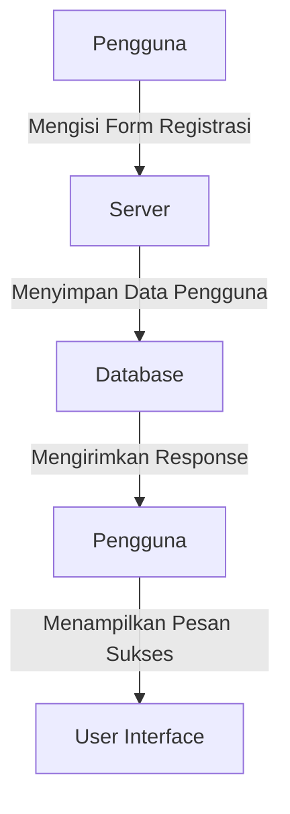
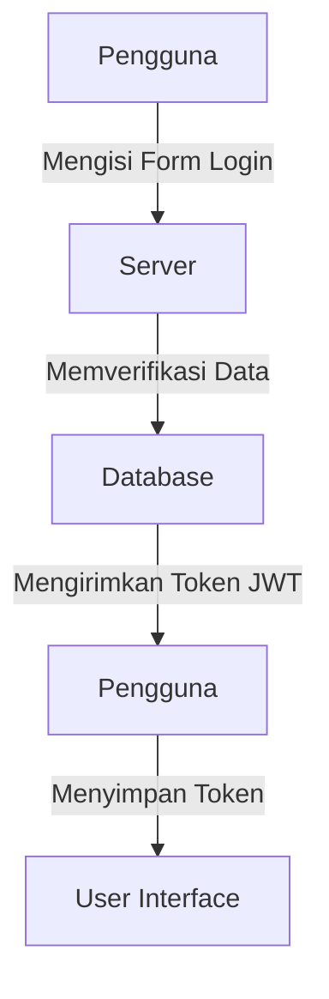
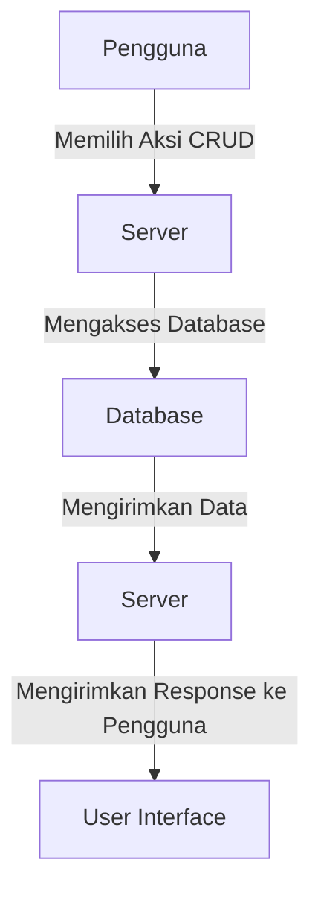

# Movie App Website

## _Platform Web untuk Menampilkan dan Mengelola Data Film_

Movie App adalah sebuah platform web yang memungkinkan pengguna untuk melihat daftar film yang menampilkan poster, judul, dan deskripsi. Pengguna dapat melakukan registrasi, login, serta mengelola (CRUD) data film dengan keamanan berbasis token JWT. Aplikasi ini dibangun menggunakan teknologi React.js, Tailwind CSS, Express.js, dan MySQL.

## Fitur Utama

- Registrasi dan login pengguna dengan keamanan berbasis token JWT.
- Menampilkan daftar film lengkap dengan poster, judul, dan deskripsi.
- CRUD film (Create, Read, Update, Delete).
- Pengelolaan pengguna dengan hashing password menggunakan bcrypt.
- Koneksi ke database MySQL untuk penyimpanan data.

## Teknologi

Movie App memanfaatkan berbagai teknologi open-source agar berjalan dengan baik:

### Frontend:

- React.js: Library untuk membangun antarmuka pengguna (UI).
- Tailwind CSS: Framework CSS untuk styling yang cepat dan efisien.
- Axios: Library untuk menangani request HTTP.
- Redux: Library untuk state management aplikasi.
- Vite: Build tool untuk pengembangan frontend yang cepat.
- react-redux: Bindings untuk menghubungkan React dengan Redux.
- react-router-dom: Library untuk routing di aplikasi React.
- react-dom: Library untuk interaksi DOM dengan React.

### Backend:

- Node.js: Evented I/O untuk backend.
- Express: Framework untuk membangun REST API.
- MySQL: Database yang digunakan untuk menyimpan data pengguna dan film.
- bcrypt.js: Untuk hashing password pengguna.
- dotenv: Untuk mengelola konfigurasi environment.
- CORS: Middleware untuk menangani akses API lintas domain.
- JWT (JSON Web Token): Digunakan untuk autentikasi berbasis token.
- multer: Middleware untuk menangani multipart/form-data, terutama untuk upload file.
- mysql2: Driver untuk menghubungkan Node.js dengan database MySQL.
- nodemailer: Library untuk mengirim email dari aplikasi.
- jsonwebtoken: Library untuk mengelola token JWT.

### Dokumentasi

- Diagram Alur Registrasi Pengguna



- Diagram Alur Login Pengguna



- Diagram Alur CRUD Film



### Instalasi dan Pengaturan

1. Menggunakan Node JS (Install node.js)
2. Menggunakan MySql (Install MySql)
3. Jalankan mysql

```
mysql -u root -p
```

4. Setelah menginstall semua, lanjutkan dengan

```
npm run dev
```

5. lalu di terminal / command prompt untuk memulai koneksi ke database MySql

```
cd /backend
node databaseConnection.js
```

6. Untuk create database bisa login ke MySql dan copy paste kan seluruh code yang ada di di schema.sql
7. Jangan lupa untuk buat file .env bila tidak ada

```
.env
VITE_API_URL=http://localhost:7001
DB_HOST=localhost
DB_USER=root
DB_PASSWORD=yourpassword
DB_DATABASE=movie_app
JWT_SECRET=yourjwtsecret
EMAIL_USER=youremail@gmail.com
EMAIL_PASS=abcd wxyz abcd wxyz

```
